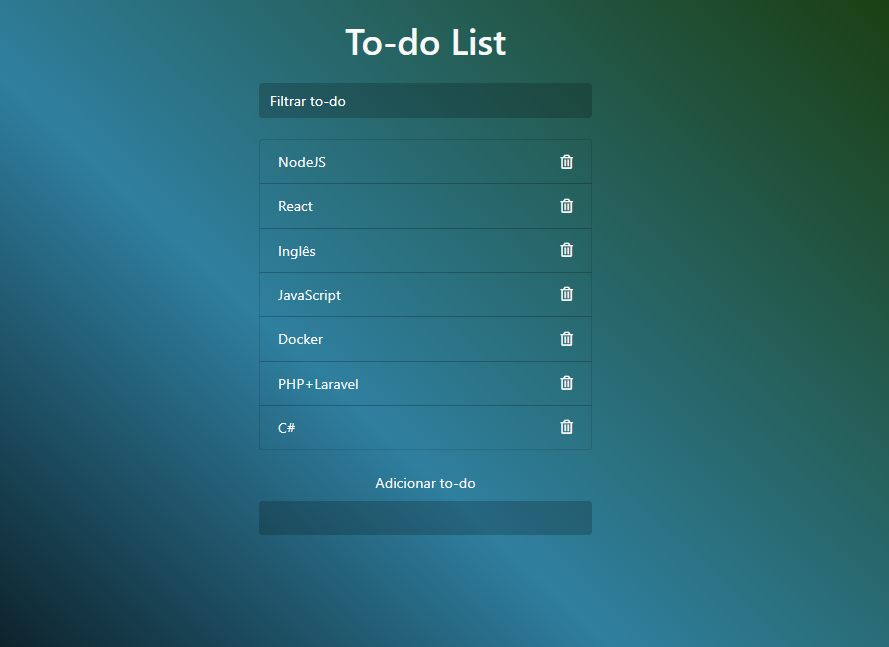

# 📂 JavaScript To-do list

## 📃 Descrição do projeto

Página web simples para ajudar na organização das suas tarefas diárias e no gerenciamento dos seus objetivos.

 

## 🌟 Características
  - Adicionar nova tarefa
  - Filtrar tarefa
  - Excluir tarefa

 

## 🚀 Tecnologias

- HTML
- CSS
- JavaScript
- Git e Github

 

## 💻 Projeto
> Frontend da aplicação 📸

  

[Acessar o projeto](https://wsawebmaster.github.io/js-to_do_list/)

 

---
---
## 📧 Contato
wsawebmaster@yahoo.com.br
